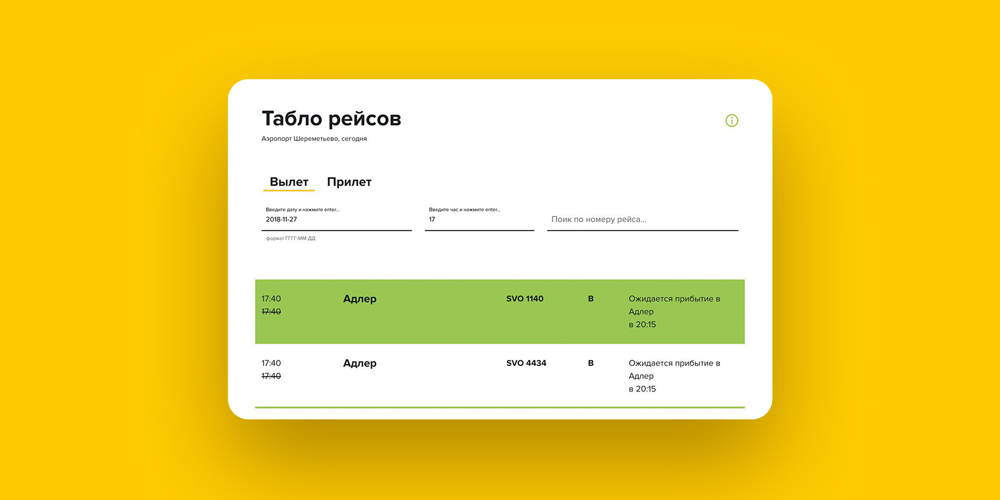

<h1>Табло рейсов</h1>

<strong>Табло рейсов</strong> — реализация тестового задания от Яндекса в качестве испытания на стажировку. В табло должны быть реализованы следующие функции:

<ul>
  <li>Просмотр только вылетающих рейсов</li>
  <li>Просмотр только прилетающих рейсов</li>
  <li>Просмотр задержанных рейсов</li>
  <li>Поиск по номеру рейса</li>
</ul>

<h2>Установка и запуск</h2>

    npm i
    gulp

<h2>Используемые библиотеки</h2>

В тестовом задании было указано, что <q>ограничений на использование шаблонизаторов и библиотек нет</q>. Поэтому я решил использовать следующие библиотеки, которые мне показались наиболее удобными

<ul>
  <li><strong>JQuery</strong> – для динамики работы с веб-приложением;</li>
  <li><strong>Vue.js</strong> – для рекативной отрисовки данных;</li>
  <li><strong>Bootstrap 4</strong> – для адаптивной верстки</li>
</ul>

    dir /fonts
    dir /images
    dir /js

<h2>Реализация</h2>

В условии задания было сказано, что использование публичных api будет плюсом. Поэтому я и начал разработку с поиска подходящих.
  Нашел наиболее подходящие здесь – <code>http://aviation-edge.com/</code>. Но пока отлаживал проект, растратил лимит обращений.
  Ценным данный ресурс был из-за того, что там была информация о задержанных рейсах, которые отобразить требуется по заданию. Далее,
  ресурс попросил меня оплатить подписку, а создать другой аккаунт – также запретил.

Второй подходящий ресурс – <code>https://api.flightstats.com/</code>. Он в итоге и вошел в конечную сборку. Здесь нет информации о задержанных рейсах.
  Но эти данные имеют ряд преимуществ. Например, для него проще создается фильтрация, которая соотвествет запросу из поиска. Также данные предоставляются по дате и конкретному часу.

Другими словами, реализации <i>задеражнных рейсов</i> у меня нет как таковой, потому что нет данных с api для отображения. Но по готовой верстке
  Вы можете заметить, что функционал для данной реализации <i>задеражнных рейсов</i> я подготовил. То есть, если добавить данные в api, то реализация будет готова.

<h3>Компенсация</h3>

Я решил добавить функционала. В данном клиентском приложении можно выбрать данные по конкретной дате и по часу. По умолчанию устанавливается текущая дата и время.
  Мне остается только надеяться, что это сгладит "невыполненный пункт", потому что других api мне найти не удалось, а создавать свой файл для реализации этих нужд совсем не хотелось,
  после того, как получилась реализация с api.

<h3>Иформация по городам</h3>

В api нет данных по городу, откуда рейс. Есть только коды аэропорта согласно спецификации iata. Чтобы максимально стремиться к референсу из задания – 
  <code>https://www.svo.aero/ru/timetable/departure?date=today&period=16:00-18:00&terminal=all</code> – хотелось бы все-таки добиться отображения читабельных названий.
  Для этих нужд я скачал файл соотвествия кодов аэропортов с названиями. Это файл <code>cases.json</code>, с ним идет необходимая фильтрация названий с помощью возможностей vue.

<h3>Мобильная версия</h3>

Данной реализации соотвествует полностью адаптивный интерфейс благодаря <code>Bootstrap 4</code>

